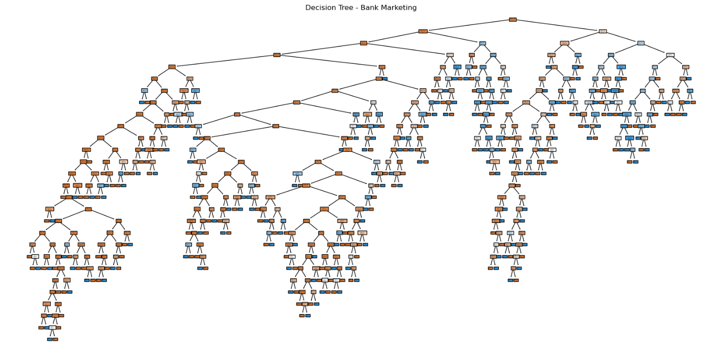
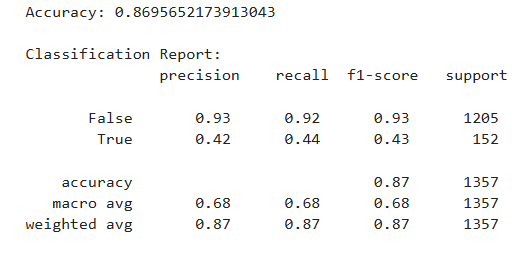

# SCT_DS_3
# 🌳 Task 3 – Decision Tree Classifier on Bank Marketing Dataset

As part of my Data Science Internship at **SkillCraft Technology**, I built a Decision Tree classifier using the Bank Marketing dataset from UCI.

This project involved preprocessing real-world marketing data, training a decision tree, and evaluating its performance using accuracy and classification metrics.

---

## 📁 Dataset Used
- Bank Marketing Dataset from [UCI ML Repository](https://archive.ics.uci.edu/ml/datasets/Bank+Marketing)
- File: `bank.csv`

---

## ⚙️ Steps Followed

1. Loaded dataset and explored structure
2. Encoded categorical variables using `get_dummies()`
3. Split into training and testing sets
4. Built a Decision Tree using `scikit-learn`
5. Evaluated model using accuracy and classification report
6. Visualized the tree using `matplotlib`

---

## ✅ Output

- **Accuracy:** 0.8695
- **Model:** DecisionTreeClassifier
- **Tools Used:** Python, Jupyter Notebook, scikit-learn, pandas, matplotlib

---

## 📸 Screenshots

### 🔹 Decision Tree Output

### 🔹 Accuracy & Report

---

## 📌 Summary

This task helped me understand:
- How decision trees classify real-world data
- Importance of data encoding and train-test split
- How to evaluate ML model performance and visualize logic

---

## 🔗 Project File
Notebook: [`DecisionTree_bank_task3.ipynb`](./DecisionTree_bank_task3.ipynb)

---

#️⃣ #SkillCraft #DataScienceInternship #MachineLearning #DecisionTree #Python #BankMarketing
